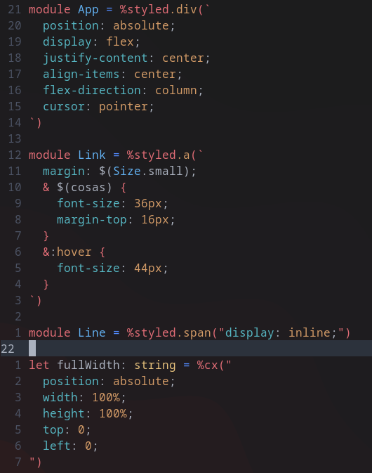

# Vim styled ppx

## Overview

Provides syntax highlighting for [styled ppx](https://github.com/davesnx/styled-ppx) in VIM.

It supports OCaml, Reason, and Rescript syntaxes

## Installation

### [VimPlug](https://github.com/junegunn/vim-plug)

Add `Plug 'ahrefs/vim-styled-ppx'` to your `~/.vimrc` and run `PlugInstall`.

### [Vundle](https://github.com/gmarik/Vundle.vim)

Add `Plugin 'ahrefs/vim-styled-ppx'` to your `~/.vimrc` and run `PluginInstall`.

### [Pathogen](https://github.com/tpope/vim-pathogen)

    $ git clone https://github.com/ahrefs/vim-styled-ppx ~/.vim/bundle/vim-log-highlighting

## Related Projects

* [styled-ppx](https://github.com/davesnx/styled-ppx) by davesnx

## Thanks

- jsit https://github.com/vim-language-dept/css-syntax.vim
- JulesWang https://github.com/JulesWang/css.vim
- ChrisYip, amadeus https://github.com/amadeus/Better-CSS-Syntax-for-Vim
- hail2u   https://github.com/hail2u/vim-css3-syntax
- leptrue  https://github.com/lepture/vim-css
